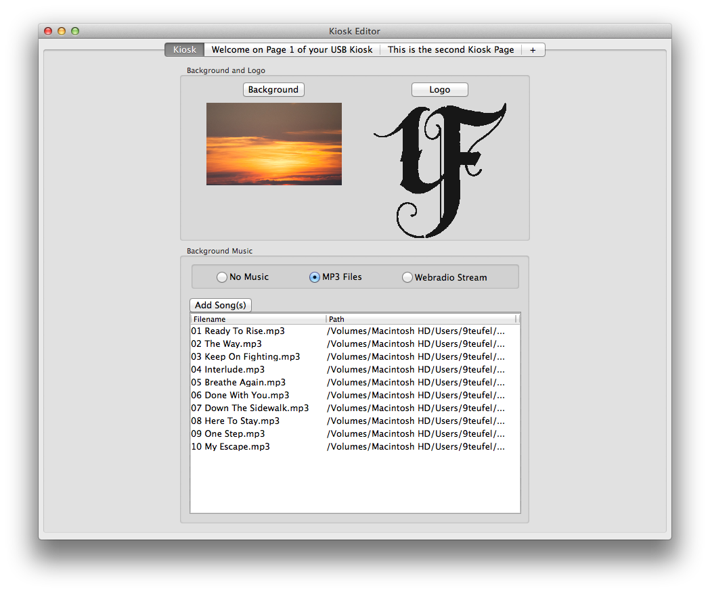
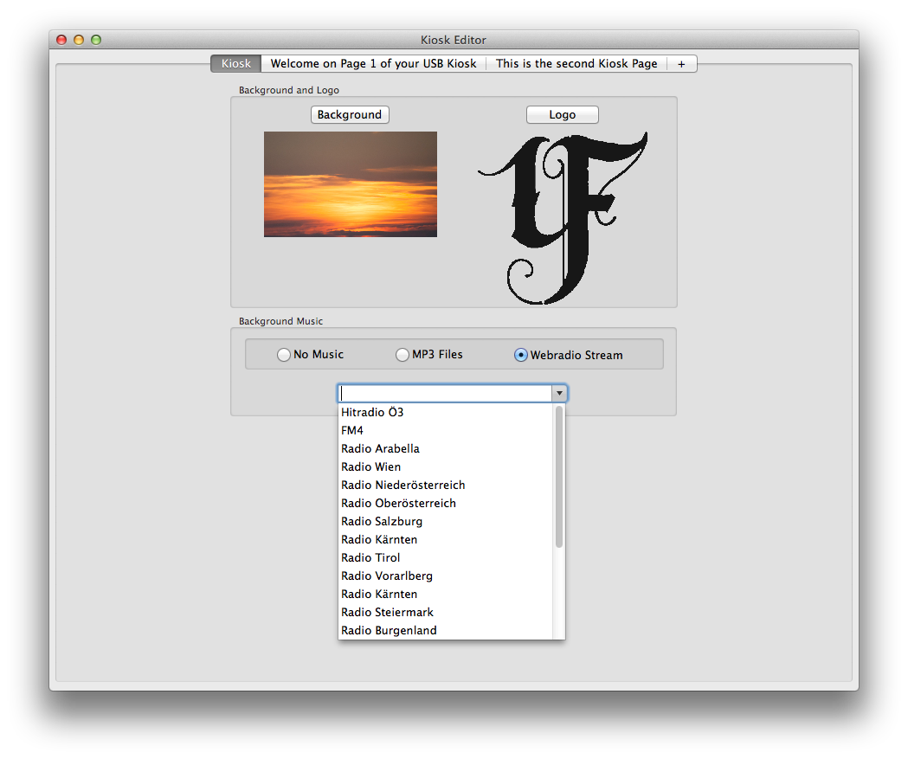
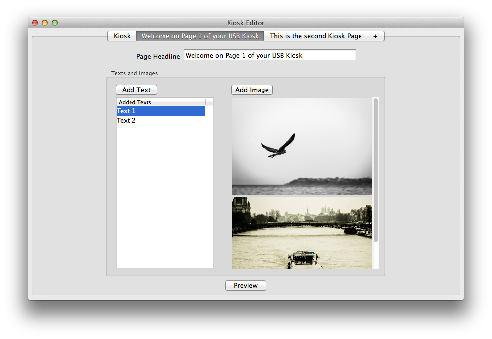
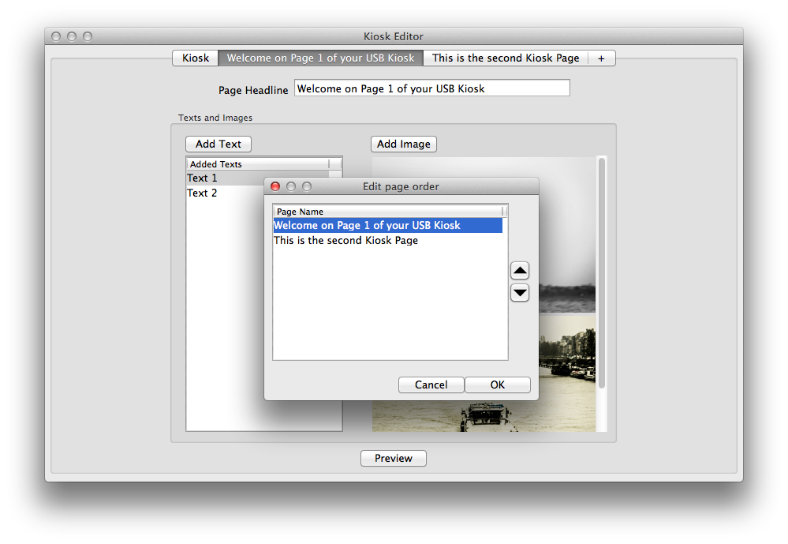

#RPi USB Kiosk for Raspberry Pi#

##Introduction##
RPi USB Kiosk for Raspberry Pi is a small html based standalone kiosk application for the Raspberry Pi. By providing an easy to use setup with an USB data stick it can be easily updated with content by anyone without the need of network knowledge or SSH access.
Once installed USB Kiosk requires no network connection and is a complete standalone solution for info screens.
The RPi USB Kiosk also supports the Raspberry Pi Clone *Banana Pi*, though most of the development and testing process takes place on a Raspberry Pi and bugs may occur on the Banana Pi.

##Installation Raspberry Pi##
The installation requires an active internet connection.
The complete installation of RPi USB Kiosk for Raspberry Pi is done with a few simple steps in which you will:
* Download the script to prepare your fresh Raspbian installation
* Run the preparation script which will launch the install script as well
* Fill your set up RPi USB Kiosk with data

###Overview###
To prepare a fresh raspberry pi Raspbian setup you run the prepare_raspbian.sh shell script which will download the additional installation script, prompt for a new user password, set the gpu memory split and expand the filesystem. When done the script launches raspi-config in case you want to modify more (e.g. time zone), otherwise simply choose finish in raspi-config and let the raspberry reboot.

When the reboot is done the raspberry will automatically launch the installation script which will install all required packages, load the up-to-date usb kiosk sources from the repo and setup the autostart of the kiosk application. The installation script has been tested on a clean Raspian Installation (version from 2014-06-20).
When the install script has finished the Raspberry Pi will reboot and show you a demo page with some Quick-Start steps. You can now prepare your data on a USB stick to setup your kiosk player.

### Installation - Step By Step###
* Setup your Raspberry Pi with a Raspbian image, just google it there are different ways to achieve this and a bunch of tools that may help you as well.
* Login to your Raspberry Pi locally or over SSH as user *pi*
* Download the preparation script that is used to initiate the setup by executing the following command:
* `wget https://raw.githubusercontent.com/peter9teufel/usb-kiosk/master/prepare_raspbian.sh`
* Make the preparation script executable with `sudo chmod +x ./prepare_raspbian.sh`
* Start installation with `sudo ./prepare_raspbian.sh`

The preparation script configures your clean Raspbian installation and launches the installation script after reboot.
Give your RPi USB Kiosk some time to install, take a coffee and be back in 15-20 minutes and everything should be done (or at least in good progress).
Preparation and installation script are automatically removed once finished and your Kiosk Player reboots to Kiosk Mode and is now ready to use.

###Installation Desktop###
The repository also holds a application to be used with RPi USB Kiosk Player called *Kiosk Editor* which is available for Mac OSX (10.6+) and Windows (Vista/7/8) at the moment.

To use the desktop application you have several ways:
  * Execute the main python script (needs all required packages to be installed locally)
  * Compile the application using pyinstaller and the provided *.spec* file (needs all required packages to be installed locally)
  * Executable version of the application can be compiled by navigating to the *Desktop* directory and executing *build_mac.sh* (Mac OS X), respectively *build_win.bat* (Windows). This will compile the desktop application, put the executable files (*.app* on Mac OS X, *.exe* on Windows) in a *Release* directory and clean up the *build* and *dist* directories. The *build_mac.sh* (Mac OS X) and *build_win.bat* (Windows) scripts need pyinstaller and all required packages to be installed locally as for building a single application directly with pyinstaller. If you have questions on the needed dependencies feel free to contact me.
  * Get a compiled version for your system (if available) at http://bit.do/usb-kiosk-downloads - I will upload working executables there in near future.

As the desktop application is a one-file-executable that has all necessary python sources packed it needs no further installation. Simply copy/paste it on your PC/Mac and execute it.
The application will create an app directory on first startup in your user folder (*.usb-kiosk*) used for temporary data. Do not modify or delete this directory while using *Kiosk Editor*. It may be deleted when you're done with Kiosk Editor as it is re-created on the next startup.

###USB preparation###
Format your USB-Stick using FAT or use any USB-Stick that is formatted in FAT. That's all for USB preparation, *Kiosk Editor* will take care about all the rest, so let's proceed.

##Kiosk Editor##
The USB Kiosk can be filled with content with a USB flash drive which is prepared with the included desktop application *Kiosk Editor*.
Kiosk Editor provides an easy-to-use User Interface to define all the pages for your kiosk player, set background- and logo images and additionally choose background music to played.

###Basic Functionalities###
The *File* and *USB* menu give you access to the basic functions like creating a new Kiosk configuration, opening a previously saved *Kiosk* file, saving the current configuration to a *Kiosk* file, writing the configuration to a USB-Stick to move it to a kiosk player or load kiosk data from a USB-Stick that was created with Kiosk Editor before or by attaching the stick to the player at startup (which creates a backup of the player data, see *Getting data from a set up Kiosk* below).

In the *File* menu you will also find the possibility to import pages, which allows you to load the pages from another kiosk file and append it to the current kiosk configuration.
By right-clicking a tab you can delete a single page from the current kiosk setup.

###Kiosk Editor - Main Page###

The main page of the Kiosk Editor application allows you to set the background and the logo for your kiosk player. The *Background Music* section allows you to choose whether to play no music at all, use MP3 files to played in the background or to stream a Webradio. You can always delete already added MP3 files by right-clicking a file and selecting *Delete*.

Several austrian (as I am from Austria) webradio streams are available, if you need any further streams to be added either send me a message with the stream address (*.m3u* or *.pls*) and I will add it to the application as soon as possible or dig in to the source files, look for *StreamAddresses.py*, add your new link and compile the Application.

###Kiosk Editor - Page Creation###
Page creation is easy, simply click on the "+" - Tab to create a new page, define a headline, add any number of texts and images and your page is ready. Double clicking a text entry in the list re-opens the text window allowing you to edit the text. Right clicking on a text entry in the list allows you to delete it.

Added images are shown as a preview in scrollable image view. To delete an added image simply click on it and confirm the dialog.

Every page needs a headline which is used as the page name in the UI as well.
You can create the following types of pages:
* Pages with at least one text, up to (theoretically) any number of texts and no images (player will show the headline and below the text field filling the screen)
* Pages with at least one image, up to (theoretically) and number of images and no texts (player will show the headline and below the image field filling the screen)
* Pages with 1-any number of texts and 1-any number of images (player will show the headline and below the text field on the left side and the image field on the right side)

The duration how long the single pages, and respectively the single texts and images on page, are shown is calculated automatically according to the amount of text to display to ensure enough time to easily read all the texts. Every image, no matter if combined with texts or on image-only pages, is shown at least 8 seconds.

####Page Preview####
Clicking the preview button on a page opens your default browser showing a preview of the texts of your page. The preview size is 860x540 (exactly half size of Full HD) and can help to check back how headline and texts will fit on your page on a Full HD screen. Background and logo on the preview site are also sample files. Your custom background, logo and images will not appear on the preview as it is intended for checking the behavior of headline and texts. Nevertheless the preview distinguishes between pages without images and only texts, pages with images only and pages that have both. For pages with set up images the preview will show two sample images (one in landscape, one in portrait).

As the preview renders the kiosk page exactly the same way as the kiosk player does using automatic text-size calculations etc. it has to run on a webserver and can not be shown locally thus it needs an active internet connection.

####Page ordering####
Initially the pages are ordered as you create them one after the other. Selecting *Edit* - *Edit page order* you can re-arrange the page order according to your needs.

####Page Import####
As already mentioned above Kiosk Editor gives you the possibility to import the pages from an other Kiosk file and append them to your current configuration. To do so select *File* - *Import Pages* and select the kiosk file with the pages you like to import.

###Creating the USB-Stick###
Creating the USB-Stick to bring the data to your kiosk player is as easy as selecting *USB* - *Create Kiosk USB-Stick*. A popup will prompt you to connect your USB-Stick if it has not been already detected before (e.g. while loading data from the USB), all data is copied to the USB-Stick and you're ready to set up the kiosk player.

###Setting up the Kiosk###
So you have finally setup your kiosk data on a USB-Stick using Kiosk Editor.
Attach the USB Flash Drive to the Raspberry Pi USB port and power on the Raspberry Pi. The Kiosk startup script will recognize your USB Flash Drive, backup the currently present files from the kiosk player in a folder called *kiosk_backup* (in case you have images, etc. you need) on your USB drive and copy the new files to the kiosk player. That's all, the player will proceed and start the kiosk with the new data.

###Getting data from a set up Kiosk###
If you ever need the data currently used on one of your RPi USB Kiosk Players simply attach an USB Flash Drive that DOES NOT contain a *kiosk* folder to the Raspberry Pi and reboot it. The startup script will backup the files from the player in a *kiosk* folder on your USB Flash Drive, ready to use to setup another player or to be loaded in Kiosk Editor selecting *USB* - *Load Kiosk from USB*. This feature is especially helpful if you need to load the data from a player to modify it or if you like to clone the data from one player to another.

###Language support###
The desktop application *Kiosk Editor* is currently available in english and german using the string files in the *lang* package (strings_de.py, strings_en.py). The language is selected according to the default locale of the system the application is started. If the language code of the default locale is unknown, english is selected as the default language.
The reading of the default locale is currently not working properly in the compiled desktop versions for Mac OS X and prevents the app from starting except when starting from the terminal. Therefor the desktop application for Mac OS X is not compiled automatically in the correct language. Have a look in the *Localizer.py* in the *lang* package, the language code to be used (currently *DE* or *EN*) is hardcoded for Mac OS X in there.
Additional languages can be added by translating the strings file for the new language and add the appropriate language code in the part where the *Localizer* (see package *lang*) checks the code of the default locale.

##License##
Copyright 2014 Peter Neunteufel

   Licensed under the Apache License, Version 2.0 (the "License");
   you may not use this file except in compliance with the License.
   You may obtain a copy of the License at

       http://www.apache.org/licenses/LICENSE-2.0

   Unless required by applicable law or agreed to in writing, software
   distributed under the License is distributed on an "AS IS" BASIS,
   WITHOUT WARRANTIES OR CONDITIONS OF ANY KIND, either express or implied.
   See the License for the specific language governing permissions and
   limitations under the License.
