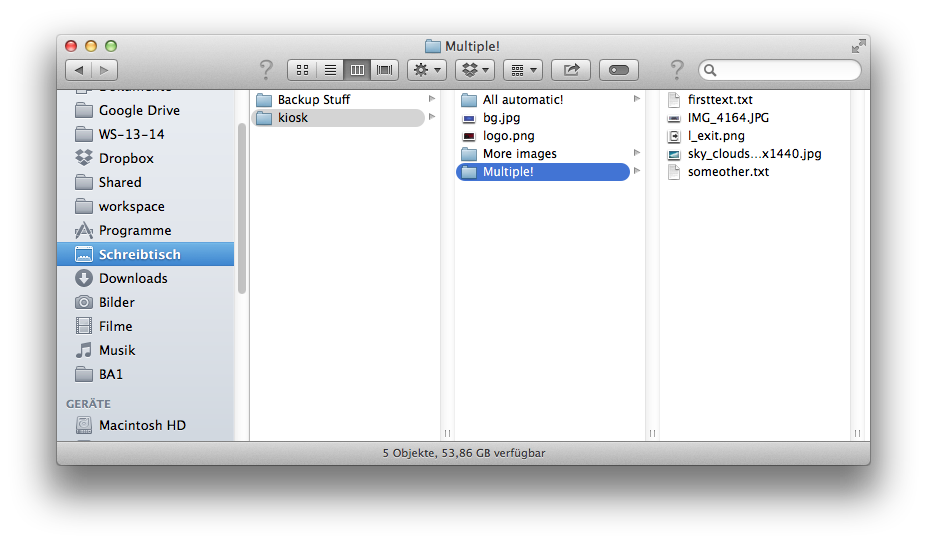

#RPi USB Kiosk for Raspberry Pi#

##Introduction##
USB Kiosk for Raspberry Pi is a small html based standalone kiosk application for the Raspberry Pi. By providing an easy to use setup with an USB data stick it can be easily updated with content by anyone without the need of network knowledge or SSH access.
Once installed USB Kiosk requires no network connection and is a complete standalone solution for info screens.

##Installation##
The installation requires an active internet connection.
The complete installation of RPi USB Kiosk for Raspberry Pi is done with a few simple steps in which you will:
* Download the script to prepare your fresh Raspbian installation
* Run the preparation script
* Fill your set up RPi USB Kiosk with data

###Overview###
To prepare a fresh raspberry pi Raspbian setup you run the prepare_raspbian.sh shell script which will download the additional installation script, prompt for a new user password, set the gpu memory split and expand the filesystem. When done the script launches raspi-config in case you want to modify more (e.g. time zone), otherwise simply choose finish in raspi-config and let the raspberry reboot.

When the reboot is done the raspberry will automatically launch the installation script which will install all required packages, load the up-to-date usb kiosk sources from the repo and setup the autostart of the kiosk application. The installation script has been tested on a clean Raspian Installation (version from 2014-06-20).
When the install script has finished the Raspberry Pi will shutdown, you can now prepare your data on a USB stick or simply start the player again to see the included demo pages.

### Installation - Step By Step###
* Setup your Raspberry Pi with a Raspbian image, just google it there are different ways to achieve this and a bunch of tools that may help you as well.
* Login to your Raspberry Pi locally or over SSH as user *pi*
* Download the preparation script that is used to initiate the setup by executing the following command:
* `wget https://raw.githubusercontent.com/peter9teufel/usb-kiosk/master/prepare_raspbian.sh`
* Make the preparation script executable with `sudo chmod +x ./prepare_raspbian.sh`
* Start installation with `sudo ./prepare_raspbian.sh`

The preparation script configures your clean Raspbian installation and launches the installation script after reboot.
Give your RPi USB Kiosk some time to install, take a coffee and be back in 15 minutes that everything should be done.

##Usage##
The USB Kiosk can be filled with content with a USB flash drive.

###USB preparation###
####Page Setup####
Format your USB Flash Drive using FAT and create a directory called *kiosk* in the root of the flash drive. For each page of the kiosk create a subfolder. The name of the page subfolder will be used as headline of the page. Avoid special characters (ö, ä, ü, etc.) in your page names by now, support for special characters will follow.

All data for a single page is provided with images and text files. RPi USB Kiosk supports multiple text files with arbitrary names. The duration of a single page is calculated based on the amount of text the page has to display (approx. 0,5s per word). If multiple text files are in a page folder, their corresponding texts are ordered based on the filenames of the text files.

Every page needs at least one image, multiple images are supported as well. The order of the images depends again on their filename. The complete time a page is shown is split up equally on all images, so each image will be visible for the same duration.
As the complete page duration depends on the amount of text the page has to display, take in account to use an appropriate number of images, it would not make much sense to define just a single sentence for a page but 10 images.

####Backup and Logo####
You can also change the background image and the logo that is displayed in the lower right corner. Simply provide the new background named *bg.jpg* and/or the new logo as PNG called *logo.png* in the *kiosk* folder.

###Setting up the Kiosk###
Assuming your USB Flash Drive is set up with a directory called *kiosk* and a subdirectory with textfile(s) and image(s) for each page you are ready now to push the data to the Raspberry Pi Kiosk Player.

Attach the USB Flash Drive to the Raspberry Pi USB port and power on the Raspberry Pi. The Kiosk startup script will recognize your USB Flash Drive, backup the currently present files from the kiosk player in a folder called *kiosk_backup* on your USB drive and copy the new files to the kiosk player. That's all, the player will proceed and start the kiosk with the new data.

###Getting data from a set up Kiosk###
If you ever need the data currently used on one of your RPi USB Kiosk Players simply attach an USB Flash Drive that DOES NOT contain a *kiosk* folder to the Raspberry Pi and reboot it. The startup script will backup the files from the player in a *kiosk* folder on your USB Flash Drive, ready to use to setup another player. This feature is especially helpful if you need to load the data from a player to modify it or if you like to clone the data from one player to another.
